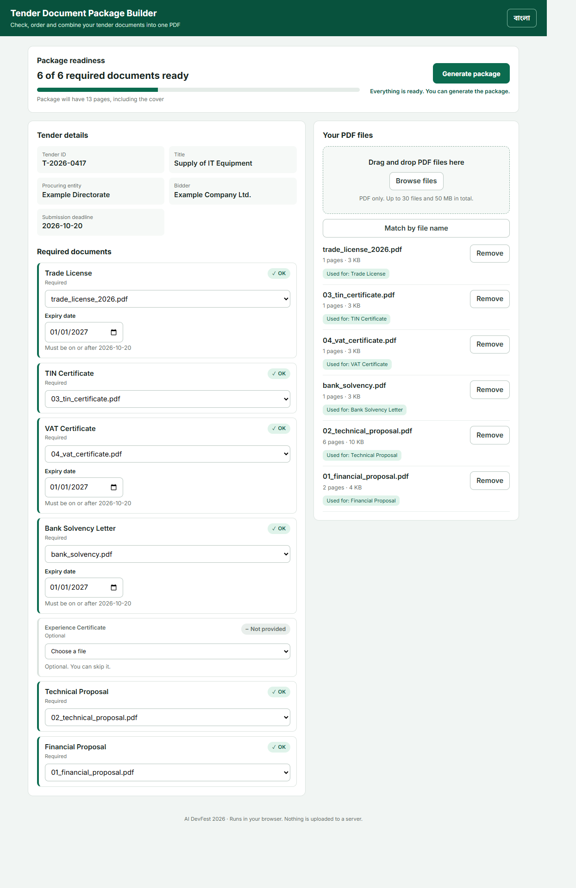
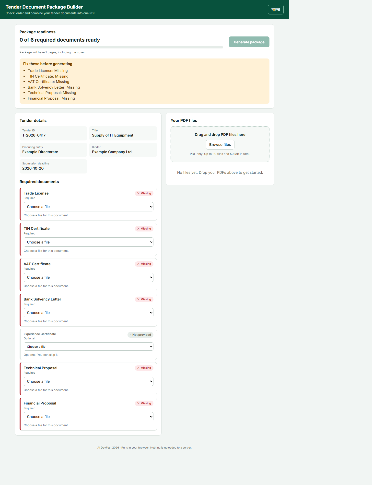

# Tender Document Package Builder

<<<<<<< HEAD
**Name:** Ratul Hasan
**Registration Number:** NOT GIVEN
**Live HTTPS Link:** https://ratulhasan02.github.io/tender-document-package-builder/

A frontend-only web app that checks, matches, validates and combines tender PDF documents into one submission-ready package.
=======
**Name:** Ratul Hasan  
**Registration Number:** NOT GIVEN 
**Live HTTPS Link:** (https://ratulhasan02.github.io/tender-document-package-builder/)
>>>>>>> 05cc8fc264b109322593f1ced3b9d7b723a34d7d

## How to run
```bash
npm install
npm run dev
```

## Production build
```bash
npm run build
```
Build output: `dist/`

<<<<<<< HEAD
## Project structure
- `src/main.jsx` - app logic and PDF generation
- `src/i18n.js` - Bangla / English text
- `src/styles.css` - styles
- `requirements.json` - tender details and requirement list (loaded by the app)
- `problem-pack/` - sample documents and requirements from the problem statement

## Screenshots




## Main features
- Tender details and ordered requirements, loaded from `requirements.json`
- PDF-only multi-file upload, with 30-file / 50 MB limits
- Browser-side PDF page counting
- One-to-one file matching (a file can be used for only one requirement)
- Expiry date validation against the submission deadline
- Statuses: Missing, Expiry date needed, Expired, Duplicate, Not provided, OK
- SHA-256 exact-content duplicate detection
- Generate button blocked while any blocking status remains, with a list of what to fix
- Browser-only combined PDF generation
- English cover page with tender details and the included-document list with page ranges
=======
## Main features
- Tender details and ordered requirements
- PDF-only multi-file upload, with 30-file / 50 MB limits
- Browser-side PDF page counting
- One-to-one file matching
- Expiry date validation against the submission deadline
- Missing, Expiry date needed, Expired, Not provided, and OK statuses
- SHA-256 exact-content duplicate detection
- Generate button blocked by blocking statuses
- Browser-only combined PDF generation
- English cover page with required tender information and included-document list
>>>>>>> 05cc8fc264b109322593f1ced3b9d7b723a34d7d
- Documents copied in requirement order, preserving all source pages
- Footer on every package page: `T-2026-0417 | Page X of Y`
- Download name: `<tender_id>_Package.pdf`
- Bangla / English language switch

## Bonus features
<<<<<<< HEAD
- Drag-and-drop PDF upload
- Filename-based match suggestions and a "Match by file name" button
- Readiness progress bar and estimated package page count
- Per-status guidance and dismissible messages
- File-specific errors for password-protected or damaged PDFs (other files still upload)

## Known problems
- Password-protected or damaged PDFs are rejected; they must be fixed and uploaded again.
- The cover page is English only, as required. Non-English characters in tender details would show as `?` on the cover.
- Tender details and requirements come from `requirements.json`; there is no screen to edit or upload them.
- Expiry dates are entered by the user; they are not read from the PDF.

## AI tools used
AI coding assistant (Claude).
=======
None added in this final core build.

## Known problems
- Damaged or password-protected PDFs are rejected with an error.
- The generated cover is English, as required by the problem statement.
- Replace the placeholder name, registration number, and live link before submission.

## AI tools used
AI coding assistant.
>>>>>>> 05cc8fc264b109322593f1ced3b9d7b723a34d7d

## Most useful prompt
The contest master prompt plus the AI DevFest Tender Document Package Builder problem statement.

## Frontend-only constraint
<<<<<<< HEAD
PDF processing happens in the browser. No participant-controlled backend, database, or online document storage is used.
=======
PDF processing happens in the browser. No participant-controlled backend, database, or online document storage is used.
>>>>>>> 05cc8fc264b109322593f1ced3b9d7b723a34d7d
